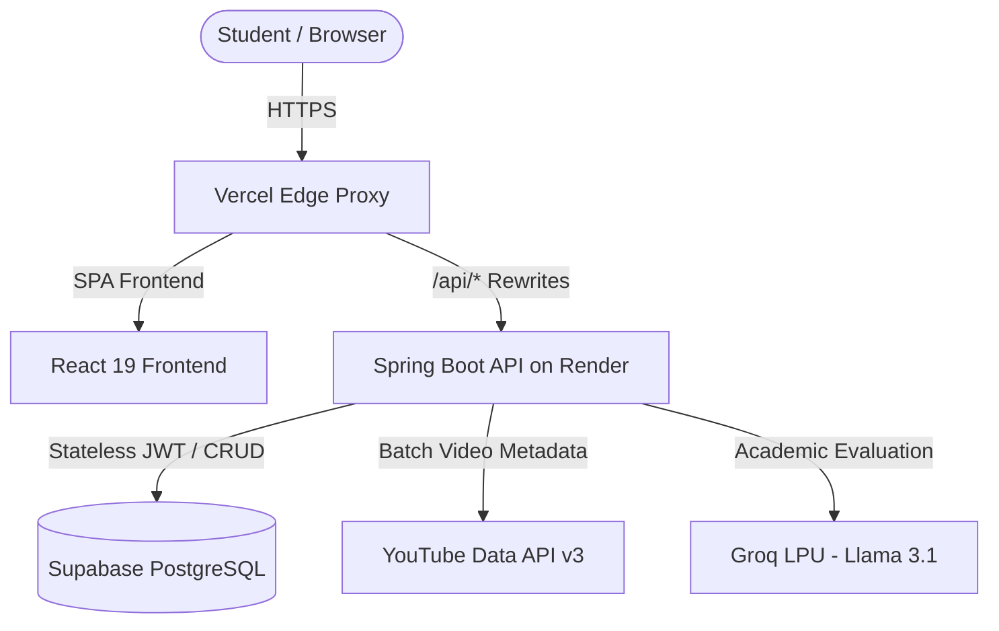

# 🧭 SkillSift — AI-Powered Course Navigator for College Students

<p align="center">
  
  
  
  
  
  
</p>

> **SkillSift** is an intelligent, distraction-free course discovery platform designed specifically for university students and developers. It sifts through hundreds of YouTube tutorials, eliminates clickbait and shorts, and uses AI to curate and rank the highest-quality courses tailored to specific academic milestones: **Placements & Interviews**, **University Exams**, and **Capstone Projects**.

---

## 🌟 Key Features

- 🎯 **Goal-Focused AI Filtering:** Filter search results based on your immediate academic goal:
  - **Placements & Interviews:** Algorithmic patterns, DSA interview problems, and system design.
  - **University Exams:** 1-shot revision marathons and conceptual theory.
  - **Capstone Projects:** Hands-on end-to-end build tutorials.
- 🧠 **AI Academic Verdicts (Groq Llama 3.1):** High-speed LLM analysis evaluating curriculum depth, structure, and clarity, giving students a 1-sentence verdict on why a course is recommended.
- 🚫 **Shorts-Free Quality Filter:** Excludes YouTube Shorts (< 3 minutes) and clickbait, returning only structured, comprehensive video courses.
- 📝 **In-Video Study Notes with Timestamps:** Embedded YouTube player equipped with an integrated notepad. Students can record timestamps and key formulas with cloud auto-save.
- 📊 **Student Learning Analytics & Profile:** Track watch hours, total saved playlists, completed courses, and configure university, branch, and graduation year.
- 🔖 **Playlists & Watch History:** Organize courses into personalized curriculum tracks with instant bookmarking.
- 🌐 **Skill Level & Regional Languages:** Filter by beginner, intermediate, or advanced, with support for regional languages (*Hindi, Telugu, Tamil, Kannada, English*).

---

## 🛠 Tech Stack & Architecture

### Frontend
- **Framework:** React 19 + Vite
- **Styling:** Modular CSS with custom design tokens (`Inter` typography, Indigo/Amber palette)
- **Icons:** Lucide React
- **HTTP Client:** Axios with JWT request interceptors
- **Hosting:** Vercel Edge with serverless reverse proxy configuration

### Backend
- **Language/Framework:** Java 21, Spring Boot 4.1
- **Security:** Stateless JWT authentication, BCrypt password hashing, custom CORS filter
- **Database:** PostgreSQL on Supabase (with transaction connection pooler)
- **ORM:** Spring Data JPA / Hibernate with explicit PostgreSQL dialect
- **Caching:** 24-hour SQL caching layer to conserve YouTube API quotas
- **AI Engine:** Groq API (`llama-3.1-8b-instant`) with resilient timeout fallbacks
- **Data Source:** YouTube Data API v3 with batch statistics fetching
- **Hosting:** Multi-stage Docker container deployed on Render

---

## 🏗 System Architecture Diagram



---

## 🚀 Getting Started Locally

### Prerequisites
- **Node.js** (v18+)
- **Java JDK** (21+)
- **Maven** (or use included `mvnw`)
- **Git**

### 1. Clone the Repository
```bash
git clone https://github.com/PavanCodeNexus/SkillSift.git
cd SkillSift
```

### 2. Configure Backend
Create `backend/src/main/resources/application-dev.properties`:
```properties
server.port=8080

spring.datasource.url=jdbc:postgresql://<your-supabase-host>:6543/postgres?sslmode=require&prepareThreshold=0
spring.datasource.username=<your-db-user>
spring.datasource.password=<your-db-password>
spring.datasource.driver-class-name=org.postgresql.Driver

spring.jpa.hibernate.ddl-auto=update
spring.jpa.database-platform=org.hibernate.dialect.PostgreSQLDialect

youtube.api.key=<your-youtube-api-key>
groq.api.key=<your-groq-api-key>
```

Run the backend:
```bash
cd backend
./mvnw spring-boot:run -Dspring-boot.run.profiles=dev
```

### 3. Configure Frontend
```bash
cd ../frontend
npm install
npm run dev
```

The frontend will start at `http://localhost:5173` and communicate with `http://localhost:8080/api`.

---

## 🌐 Live Deployment Links

- **Live Platform:** [https://skill-sift-hazel.vercel.app](https://skill-sift-hazel.vercel.app)
- **Backend API:** [https://skillsift-backend-xazf.onrender.com](https://skillsift-backend-xazf.onrender.com)
- **GitHub Repository:** [https://github.com/PavanCodeNexus/SkillSift](https://github.com/PavanCodeNexus/SkillSift)

---

## 📄 License
This project is licensed under the MIT License. Built with ❤️ for college students and developers.
